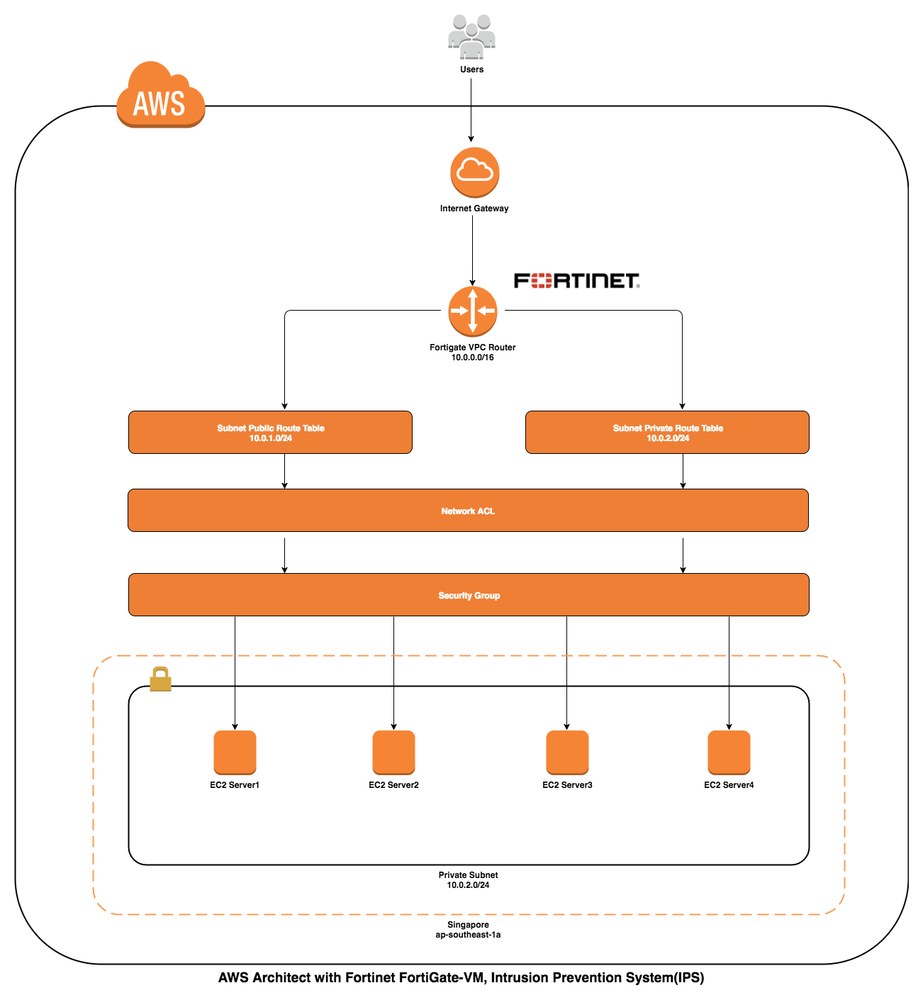
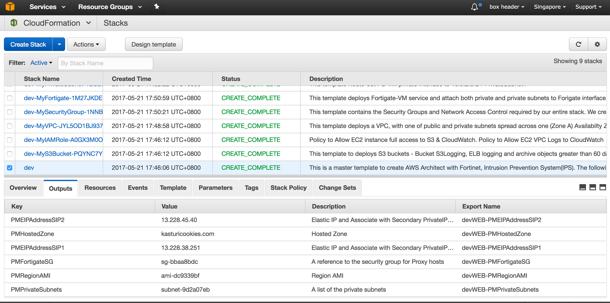
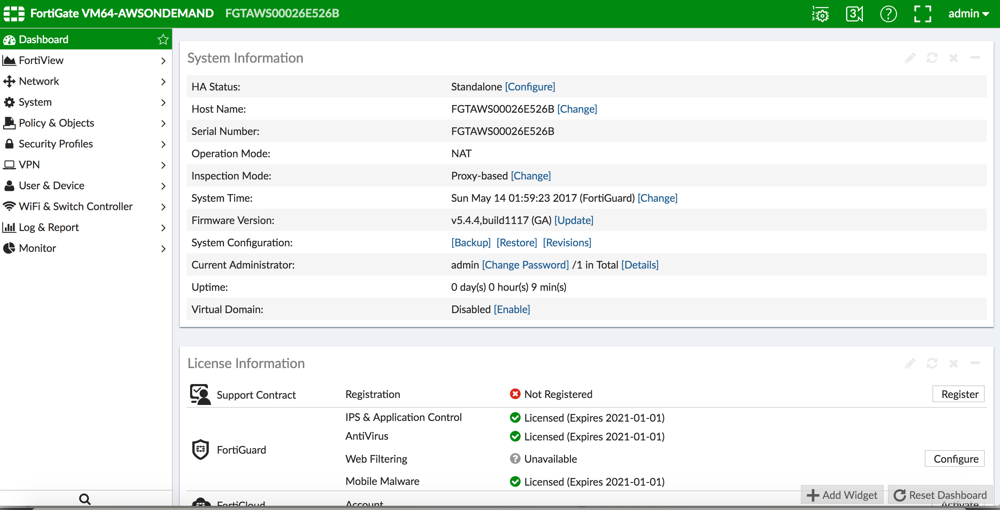

# Deploying AWS Architect with Fortinet, Intrusion Prevention System(IPS)

## Fortinet
- Product Information, [Inside FortiOS](http://docs.fortinet.com/uploaded/files/1701/inside-fortios-ips-50.pdf)
- How to [AWS Deployment Setup](http://docs.fortinet.com/uploaded/files/2082/fortigate-aws-deployment.pdf)
- [Video Tips and Configuration](http://help.fortinet.com/fos50hlp/54/Content/FortiOS/fortiOS-HTML5-v2/MediaPage.htm)
- AWS MarketPlace: [Fortinet FortiGate-VM](https://aws.amazon.com/marketplace/pp/B00PCZSWDA?qid=1494650596233&sr=0-2&ref_=srh_res_product_title)
- Video Tutorial to Setup [DDos/Dos Attack Policy](https://www.youtube.com/watch?v=uJr3L61vCsI)

This reference architecture provides a set of YAML templates for deploying the following AWS services :
- Amazon IAM
- Amazon VPC
- Amazon EC2
- Amazon S3
- Amazon Route53
- Amazon Security Group & NACL

## Prerequisites Notes
The Cloudformation Security Group IP address is open by default (testing purpose). You should update the Security Group Access with your own IP Address to ensure your instances security.

Before you can deploy this process, you need the following:
 - Your AWS account must have one VPC available to be created in the selected region
 - Amazon EC2 key pair
 - Installed Domain in Route 53.
 - Installed Certificate (in your selected region & also one in us-east-1) 

## You can launch this CloudFormation stack in the following Region in your account:
 - US East (N. Virginia)
 - US West (N. California)
 - Asia Pacific (Tokyo)
 - Asia Pacific (Singapore)
 - Asia Pacific (Sydney)



The repository consists of a set of nested templates that deploy the following:

 - A tiered [VPC](http://docs.aws.amazon.com/AmazonVPC/latest/UserGuide/VPC_Introduction.html) with public and private subnets, spanning an AWS region.

## Why use AWS CloudFormation with AWS Fortinet?

Using CloudFormation to deploy and manage services with ECS has a number of nice benefits over more traditional methods ([AWS CLI](https://aws.amazon.com/cli), scripting, etc.). 

#### Infrastructure-as-Code

A template can be used repeatedly to create identical copies of the same stack (or to use as a foundation to start a new stack).  Templates are simple YAML- or JSON-formatted text files that can be placed under your normal source control mechanisms, stored in private or public locations such as Amazon S3, and exchanged via email. With CloudFormation, you can see exactly which AWS resources make up a stack. You retain full control and have the ability to modify any of the AWS resources created as part of a stack. 

#### Self-documenting 

Fed up with outdated documentation on your infrastructure or environments? Still keep manual documentation of IP ranges, security group rules, etc.?

With CloudFormation, your template becomes your documentation. Want to see exactly what you have deployed? Just look at your template. If you keep it in source control, then you can also look back at exactly which changes were made and by whom.

#### Intelligent updating & rollback

CloudFormation not only handles the initial deployment of your infrastructure and environments, but it can also manage the whole lifecycle, including future updates. During updates, you have fine-grained control and visibility over how changes are applied, using functionality such as [change sets](https://aws.amazon.com/blogs/aws/new-change-sets-for-aws-cloudformation/), [rolling update policies](http://docs.aws.amazon.com/AWSCloudFormation/latest/UserGuide/aws-attribute-updatepolicy.html) and [stack policies](http://docs.aws.amazon.com/AWSCloudFormation/latest/UserGuide/protect-stack-resources.html).

## Template details

The templates below are included in this repository and reference architecture:

| Template | Description |
| --- | --- | 
| [master.yaml](master.yaml) | This is the master template - deploy it to CloudFormation and it includes all of the nested templates automatically. |
| [infrastructure/fortinet-iam.yaml](infrastructure/fortinet-iam.yaml) | This template deploys will create policy to allow EC2 instance full access to S3 and VPC Logs to CloudWatch. |
| [infrastructure/fortinet-s3bucket.yaml](infrastructure/fortinet-s3bucket.yaml) | This template deploys Backup Bucket for ELB logging. |
| [infrastructure/fortinet-vpc.yaml](infrastructure/fortinet-vpc.yaml) | This template deploys a VPC with a pair of public and private subnets spread across same Availability Zones. It deploys an [Internet gateway](http://docs.aws.amazon.com/AmazonVPC/latest/UserGuide/VPC_Internet_Gateway.html), with a default route on the public subnets. It deploys 2 [NAT gateways](http://docs.aws.amazon.com/AmazonVPC/latest/UserGuide/vpc-nat-comparison.html), and default routes for them in the private subnets. |
| [infrastructure/fortinet-securitygroup.yaml](infrastructure/fortinet-securitygroup.yaml) | This template contains the [security groups](http://docs.aws.amazon.com/AmazonVPC/latest/UserGuide/VPC_SecurityGroups.html) and [Network ACLs](http://docs.aws.amazon.com/AmazonVPC/latest/UserGuide/VPC_ACLs.html) required by the entire stack. |
| [infrastructure/fortinet-fortigate-vm.yaml](infrastructure/fortinet-fortigate-vm.yaml) | This template deploys the Fortigate-VM router service. |
| [infrastructure/fortinet-privatesubnet.yaml](infrastructure/fortinet-privatesubnet.yaml) | This template Route-out FG-VM private interface to 10.0.2.0/24-PrivateSubnet1. |
| [infrastructure/fortinet-route53.yaml](infrastructure/fortinet-route53.yaml) | This template deploys Route 53 recordset to update public IP and A record. |
| [infrastructure/fortinet-webserver.yaml](infrastructure/fortinet-webserver.yaml) | This template deploys multiple webserver instances as a testing platform. |

After the CloudFormation templates have been deployed, the [stack outputs](http://docs.aws.amazon.com/AWSCloudFormation/latest/UserGuide/outputs-section-structure.html) contain a link to the load-balanced URLs for each of the deployed microservices.



## How do I...?

### Get started and deploy this into my AWS account

You can launch this CloudFormation stack in your account:

Example using AWS CLI Command :

1. First Download this code into your workstation, make your own changes and make the prerequisites updates.
 - Your AWS account must have one VPC available to be created in the selected region.
 - Create Amazon EC2 key pair
 - Install a domain in Route 53.
 - Install a certificate (in your selected region & also one in us-east-1) 

2. Next install [AWS CLI](aws.amazon.com/cli) in your workstation.

3. Upload the files in the "infrastructure" directory into to your own S3 bucket.
 - Eg. aws s3 cp --recursive infrastructure/ s3://cf-templates-19sg5y0d6d084-ap-southeast-1/

4. You can run the master.yaml file from your workstation.


#### Stage 1 (Deploy VPC and Fortigate Router)
```
Stage1 (~ 10 - 15 minutes)
===========================
To create a environment :
aws cloudformation create-stack \
--stack-name <env> \
--capabilities=CAPABILITY_NAMED_IAM \
--template-body file:////path_to_template//cloudformation-project3//master.yaml

To update a environment :
aws cloudformation update-stack \
--stack-name <env> \
--capabilities=CAPABILITY_NAMED_IAM \
--template-body file:////path_to_template//cloudformation-project3//master.yaml

To delete a environment :
aws cloudformation delete-stack --stack-name <env>

<env> - Note :stack-name that can be used are (dev, staging, prod)
```

#### Stage 2 (Setup Fortinet)


```
SSH to the FortiGate

$ssh admin@xx.xx.xx.xx
admin@xx.xx.xx.xx's password: 
FGTAWS00026E526B # 

FGTAWS00026E526B # execute ping 8.8.8.8
PING 8.8.8.8 (8.8.8.8): 56 data bytes
64 bytes from 8.8.8.8: icmp_seq=0 ttl=56 time=3.0 ms
64 bytes from 8.8.8.8: icmp_seq=1 ttl=56 time=2.1 ms
--- 8.8.8.8 ping statistics ---
2 packets transmitted, 2 packets received, 0% packet loss
round-trip min/avg/max = 2.1/2.5/3.0 ms

FGTAWS00026E526B # execute update-now

Format Disk Logging,

FGTAWS00026E526B # get sys status 

Check "Log hard disk: Need format"

FGTAWS00026E526B # execute formatlogdisk
Log disk is /dev/xvdb.
Formatting this storage will erase all data on it, including
  logs, quarantine files;
and require the unit to reboot.
Do you want to continue? (y/n)y

Go and Login to Fortigate Management Page,
https://xxx.xxx.xxx.xxx

- Increase Session TimeOut.
System >> Setting >> Idle TimeOut = 50 Minutes [Apply]

- Re-Strict Fortigate Control Panel Access
System >> Administrator >> Edit Trusted Host and update your network ip address.

- Install SSL Cert and CA bundle certs.
Follow the instruction reference, how to fix fortigate ssl cert :
https://www.youtube.com/watch?v=gF486X6F6mc

- Update Firmware (Based on the current available firmware) :
Firmware Version v5.4.2,build9380 (GA) [Update] [Apply]
Update and Reboot : v5.4.4,build1117

- Configure Network Interface
Network >> Interfaces
Select Port1 (WAN1) ->[Edit] and [Save]
Select Port2 (LAN1) ->[Edit] and [Save]

- Network >> DNS >> Specify Update
Primary DNS Server   : 8.8.8.8
Secondary DNS Server : 8.8.4.4
Local Domain Name : <your domain name>

- Configure Policy & Objects (Add ServerIP)
Policy & Objects >> Virtual IPs
Select [+ Create New] >> [Virtual IP]

- Configure Policy & Objects (Add Office/Home NetworkIP)
Policy & Objects >> Addresses
Select [+ Create New ] >> [Address]

- Configure Policy & Objects (Add Firewall)
Policy & Objects >> IPv4 Policy
Select [+ Create New ]
1. Outbound Entry
2. Webserver-SSH Entry
3. Webserver-HTTP Entry
4. Webserver-HTTPS Entry
5. Webserver-ICMP Entry

- Backup Config
Save conf file to your local machine

```


#### Stage 3 (Deploy Multi Webservers under Fortigate Router as a testing platform)
```
Stage3 (~ 5 - 10 minutes)
===========================
To create a environment :
aws cloudformation create-stack \
--stack-name <envWEB> \
--capabilities=CAPABILITY_NAMED_IAM \
--template-body file:////path_to_template//cloudformation-project3//infrastructure//fortinet-webserver.yaml

To update a environment :
aws cloudformation update-stack \
--stack-name <envWEB> \
--capabilities=CAPABILITY_NAMED_IAM \
--template-body file:////path_to_template//cloudformation-project3//infrastructure//fortinet-webserver.yaml

To delete a environment :
aws cloudformation delete-stack --stack-name <envWEB>

<envCDN> - Note :stack-name that can be used are (devWEB, stagingWEB, prodWEB)


Example :
aws cloudformation create-stack \
--stack-name dev \
--capabilities=CAPABILITY_NAMED_IAM \
--template-body file:////path_to_template//cloudformation-project3//master.yaml

aws cloudformation create-stack \
--stack-name devWEB \
--capabilities=CAPABILITY_NAMED_IAM \
--template-body file:////path_to_template//cloudformation-project3//infrastructure//fortinet-webserver.yaml
	
```


### Deploy multiple environments (e.g., dev, staging, production)

Deploy another CloudFormation stack from the same set of templates to create a new environment. The stack name provided when deploying the stack is prefixed to all taggable resources (e.g., EC2 instances, VPCs, etc.) so you can distinguish the different environment resources in the AWS Management Console. 

### Change the VPC or subnet IP ranges

This set of templates deploys the following network design:

| Item | CIDR Range | Usable IPs | Description |
| --- | --- | --- | --- |
| VPC | 10.0.0.0/16 | 65,536 | The whole range used for the VPC and all subnets |
| Public Subnet 1 | 10.0.1.0/24 | 251 | The public subnet in the first Availability Zone |
| Public Subnet 2 | 10.0.2.0/24 | 251 | The private subnet in the first Availability Zone |

You can adjust the following section of the [master.yaml](master.yaml) template:

```
# Update Domain Name
PMHostedZone:
  Default: "kasturicookies.com"
  Description: "Enter an existing Hosted Zone."
  Type: "String"

# Update Sub-domain and instance type
dev:
  FortigateDomain: "api.kasturicookies.com"
  Webserver1Domain: "dev.kasturicookies.com"
  Webserver2Domain: "devel.kasturicookies.com"
  PMFortinetInstanceType: "m3.medium"

staging:
  FortigateDomain: "staging-fortigate.kasturicookies.com"
  Webserver1Domain: "staging1.kasturicookies.com"
  Webserver2Domain: "staging2.kasturicookies.com"
  PMFortinetInstanceType: "m3.medium"

prod:
  FortigateDomain: "fortigate.kasturicookies.com"
  Webserver1Domain: "www1.kasturicookies.com"
  Webserver2Domain: "www2.kasturicookies.com"
  PMFortinetInstanceType: "c4.large"

# CIDR ranges
MyVPC:
  Type: "AWS::CloudFormation::Stack"
  DependsOn:
  - "MyIAMRole"
  Properties:
    TemplateURL: !Sub "${PMTemplateURL}/fortinet-vpc.yaml"
    TimeoutInMinutes: '5'
    Parameters:
      PMServerEnv: !Ref "AWS::StackName"
      PMVpcCIDR: "10.0.0.0/16"
      PMPublicSubnet1CIDR: "10.0.1.0/24"
      PMPrivateSubnet1CIDR: "10.0.2.0/24"
      PMFlowLogRole: !GetAtt "MyIAMRole.Outputs.VPCFlowLogRoleArn"

```

### Add a new item to this list

If you found yourself wishing this set of frequently asked questions had an answer for a particular problem, please [submit a pull request](https://help.github.com/articles/creating-a-pull-request-from-a-fork/). The chances are that others will also benefit from having the answer listed here.

## Contributing

Please [create a new GitHub issue](https://github.com/thinegan/cloudformation-project3/issues/new) for any feature requests, bugs, or documentation improvements. 

Where possible, please also [submit a pull request](https://help.github.com/articles/creating-a-pull-request-from-a-fork/) for the change. 

## Author

Thinegan Ratnam
 - [http://thinegan.com](http://thinegan.com/)

## Copyright and License

Copyright 2017 Thinegan Ratnam

Code released under the MIT License.